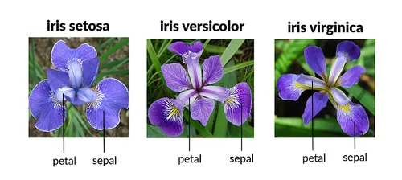
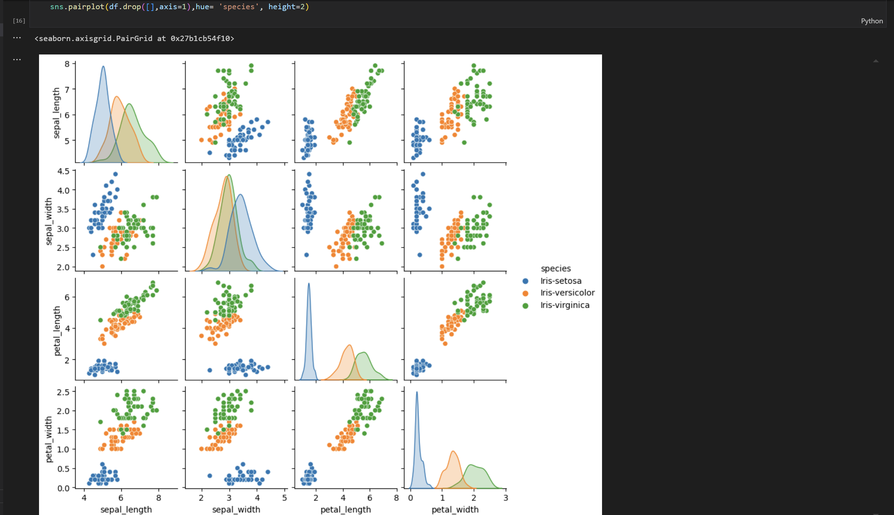
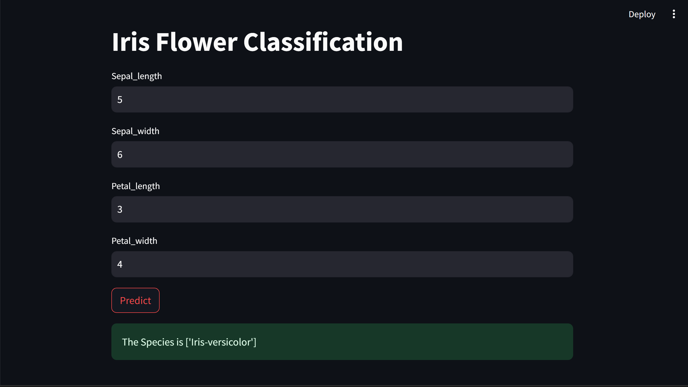

#gdsc_workshop_iris_flower_classification

Developed a machine learning model for Iris flower classification using Python and Scikit-Learn, achieving 95% accuracy. Serialized the model with Pickle and deployed it using Streamlit. Conducted a workshop to demonstrate the project and deployment process.

